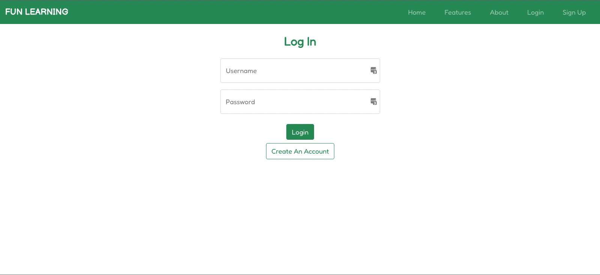

# Fun Learning
React application for toddlers to learn basic things through familiar objects in pictures.\
Deployed URL: https://fun-learning.surge.sh

## Table of Contents
- [About](#about)
- [Features](#features)
  - [Navigation bar](#navigation-bar)
  - [Landing page](#landing-page)
  - [Learn things in different categories](#categories)
    - [Alphabet](#alphabet)
    - [Numbers](#numbers)
    - [Colors](#colors)
    - [Shapes](#shapes)
- [User Flows](#user-flows)
- [API](#api)
- [Technology Stack Used](#technology-stack-used)
  - [Front-end](#front-end)
  - [Back-end](#back-end)
  - [Database](#database)
- [Deployment](#deployment)
- [Screenshots](#screenshots)
- [Available Scripts](#available-scripts)
- [Sources](#sources)

## About
This React app was created for my final project at a coding bootcamp, and behind the motivation to help entertain my 2-year-old daughter.

## Features

### Navigation bar
- Navigation bar is visible on the top of each pages. It is responsive and will adapt to different devices.
- Navigation scheme:
  - On the left side is the site's brand name. It can also be used to navigate to the Homepage.
  - On the right side is the collapse burger menu. It contains 5 tabs if not registed:
    - Home
    - Features
    - About
    - Login
    - Sign Up
  - After registered and logged in, there will be 4 tabs on the navigation bar:
    - Home
    - Categories
      - Alphabet
      - Colors
      - Numbers
      - Shapes
    - User's Profile
    - Logout 

### Landing page
Single-page contains the following sections:
- Hero section: including a big heading and Try It Out button for demo purposes
- Features: including 4 learning categories
- About
- Call to Action
- Footer

### Categories

#### Alphabet
Learn ABC phonics, letters and build vocabularies.

#### Numbers
123, count with me! Learn to count from 1 to 10.

#### Colors
Introduce primary, secondary colors, and more!

#### Shapes
Learn basic shapes with examples in every day life.

## User Flows
- Users need to register to use the app. However, there is a demo feature by pressing the button Try It Out.
- Once registered, users have access to all the categories with sounds when pressing the Play button on each item.

## API
Self-written [Fun Learning API](https://fun-learning-api.herokuapp.com/categories)

## Technology Stack Used

### Front-end:
- React
- CSS
- Bootstrap
- Font Awesome

### Back-end:
- Node.js
- Express
- JWT

### Database:
- PostgreSQL

## Deployment

This application is currently live [here](https://fun-learning.surge.sh).

## Screenshots

### Homepage

### Forms

### Content

## Available Scripts

In the project directory, you can run:

### `npm start`

Runs the app in the development mode.\
Open [http://localhost:3000](http://localhost:3000) to view it in your browser.

The page will reload when you make changes.\
You may also see any lint errors in the console.

### `npm test`

Launches the test runner in the interactive watch mode.\
See the section about [running tests](https://facebook.github.io/create-react-app/docs/running-tests) for more information.

## Sources

- Beautiful pictures from talented photographers at [Unplash website](https://unsplash.com)
- [Stack Overflow](https://stackoverflow.com) community to help trouble-shooting along the way 🙏 
